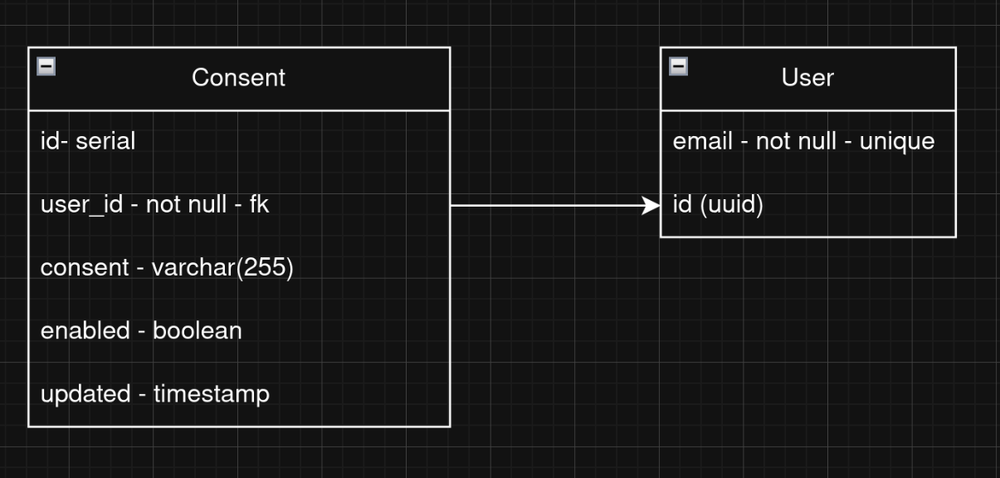

# Getting Started
Before running, make sure the docker dependencies are running. These are defined in `compose.yaml`, so running `docker compose up -d` should get things running.
Please wait for the database and rabbitmq containers to be fully operational before starting the application.

In the `misc/` directory, you will find a postman collection to document all the endpoints provided by the API.

# Features
### User
- [x] Create user with email validations (return 422 when validations fail)
- [x] Get either all or a single user
- [x] Update user
- [x] Delete user

### Consent
- [x] Create consent and link to user
- [x] Send consent events to queue for async processing and storage

# Database
The database initialization script can be found in `src/main/resources/static/sql/init/init.sql`

# Tests
The first run of tests might be slow, since we are using a testcontainer for the queue integration test. Once the container is downloaded, the tests should run in a reasonable timeframe.

# Considerations
`Consent change events can only be read and created, not update or deleted` I took this to mean that the events sent to the queue are creation events. The way I understand the system is that these will be stored in a datawarehouse. The API stores a snapshot of the latest consents in its database for performance. This snapshot does get updated, but my design would allow consent changes to be stored for auditing purposes in a separate system.

